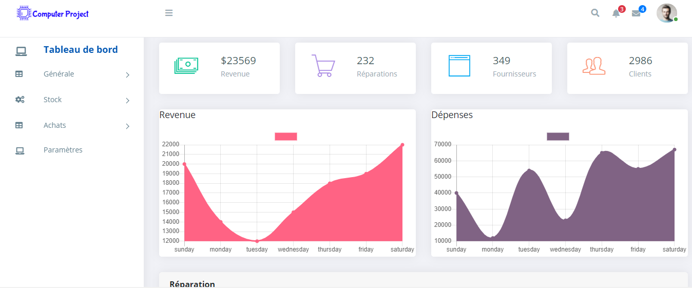

# Computer Project

Computer project is a web application that allows the management of the maintenance operation in a repair shop for digital devices (mobile phones, personal computer, etc.)

  

## Introduction

Library lab is a web application for managing a library by making it easier to borrow books from readers. This application is a virtual version of a real bookstore.

## Informations : 
- Status: under development
- Lastest version 1.0
- Sector: industry
- Created: December 2020
- Last updated: December 2020

## Table of contents
* [Documentation](#general-info)
* [Demo](#demo)
* [Screenshots](#screenshots)
* [Technologies](#technologies)
* [Setup](#setup)
* [Features](#features)
* [Status](#status)
* [Contact](#contact)
* [License](#license)

## Documentation
https://github.com/aniskchaou/COMPUTER-PROJECT-FRONTEND-ADMIN/wiki

## Demo
https://computer-project.herokuapp.com/

## Screenshots

## Technologies
* Spring boot
* Angular

## Setup

## Modules:
- Manage products
- Manage suppliers
- Manage clients
- Manage invoices

  

## Contact
contact@delta-dev-software.com

## License
<a href="license.txt">MIT License</a>